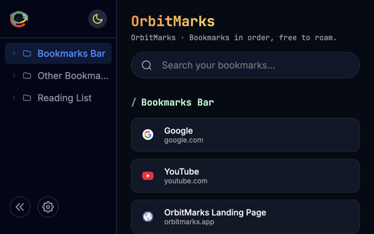
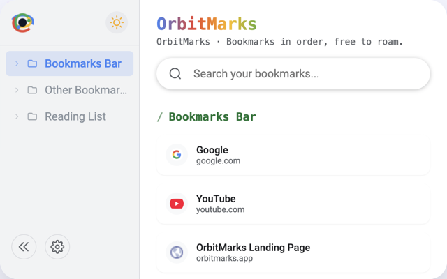

# OrbitMarks

<p align="center">
  
</p>

<p align="center">
  <strong>A modern Chrome extension for managing bookmarks with style.</strong>
</p>

<p align="center">
  
  
  
</p>

---

OrbitMarks transforms your messy bookmark collection into a beautifully organized launchpad. Built with Manifest V3, it features a clean Material-inspired design with terminal typography, live search, nested folder navigation, and full multilingual support.

## ✨ Features

| Feature | Description |
|---------|-------------|
| 🔍 **Live Search** | Instantly filter bookmarks by title or URL within the current folder |
| 📁 **Nested Navigation** | Expand/collapse folders in sidebar with persistent state memory |
| 🌗 **Theme Toggle** | One-click switch between dark and light themes |
| 🌐 **11 Languages** | Full i18n support with "Follow System" option |
| ⚡ **Lightweight** | Only requires `bookmarks` permission, no background scripts |
| ✨ **Particle Effects** | Subtle animated background with auto-pause when hidden |

## 📸 Screenshots

<table>
  <tr>
    <td align="center">
      <strong>Dark Theme</strong><br>
      
    </td>
    <td align="center">
      <strong>Light Theme</strong><br>
      
    </td>
  </tr>
</table>

## 🚀 Installation

### From Chrome Web Store
> Coming soon...

### Manual Installation (Developer Mode)

1. Clone or download this repository:
   ```bash
   git clone https://github.com/lyq3/Orbit-Marks.git
   cd Orbit-Marks
   ```

2. Open Chrome and navigate to `chrome://extensions`

3. Enable **Developer mode** (toggle in top-right corner)

4. Click **Load unpacked** and select the repository folder

5. Pin the OrbitMarks icon to your toolbar for quick access

## 📁 Project Structure

```
OrbitMarks/
├── manifest.json      # Extension manifest (MV3)
├── popup.html         # Main popup UI
├── popup.js           # Core logic & i18n translations
├── styles.css         # Theme variables & styling
├── particles.js       # Background particle animation
├── icons/             # Extension icons (16/48/128px)
└── docs/screenshots/  # Store listing assets
```

## 🛠 Development

This extension uses vanilla JavaScript with no build step required.

```bash
# Clone the repository
git clone https://github.com/lyq3/Orbit-Marks.git

# Load in Chrome as unpacked extension
# Make changes and reload extension to see updates
```

### Customization

- **Icons**: Replace PNGs in `icons/` directory
- **Languages**: Add translations to `TRANSLATIONS` object in `popup.js`
- **Themes**: Modify CSS variables in `:root` and `[data-theme="light"]` in `styles.css`

## 🧪 Tech Stack

- **Manifest Version**: 3 (latest Chrome extension standard)
- **Permissions**: `bookmarks` only
- **External Resources**:
  - Google Fonts (Inter, JetBrains Mono, Roboto)
  - Google Favicon Service (for bookmark icons)

## 🌐 Supported Languages

| Language | Code |
|----------|------|
| English | `en-US` |
| 简体中文 | `zh-CN` |
| 繁體中文 | `zh-TW` |
| 日本語 | `ja-JP` |
| 한국어 | `ko-KR` |
| Español | `es-ES` |
| Français | `fr-FR` |
| Deutsch | `de-DE` |
| Português | `pt-BR` |
| Русский | `ru-RU` |

## 📝 Changelog

### v1.2.1
- Fixed LocalStorage key naming inconsistency
- Fixed navigation stack double-push issue
- Added URL search support
- Added Page Visibility API for animation optimization
- Improved CSS compatibility and font loading

### v1.2
- Initial public release
- Core bookmark management features
- Multi-language support
- Dark/Light theme toggle

## 💬 Support

Questions, bugs, or feature requests? 

- 📧 Email: [support@btman.net](mailto:support@btman.net)
- 🐛 Issues: [GitHub Issues](https://github.com/lyq3/Orbit-Marks/issues)

## 📄 License

MIT License - feel free to use and modify for your own projects.

---

<p align="center">Made with ❤️ for an organized browsing experience</p>
