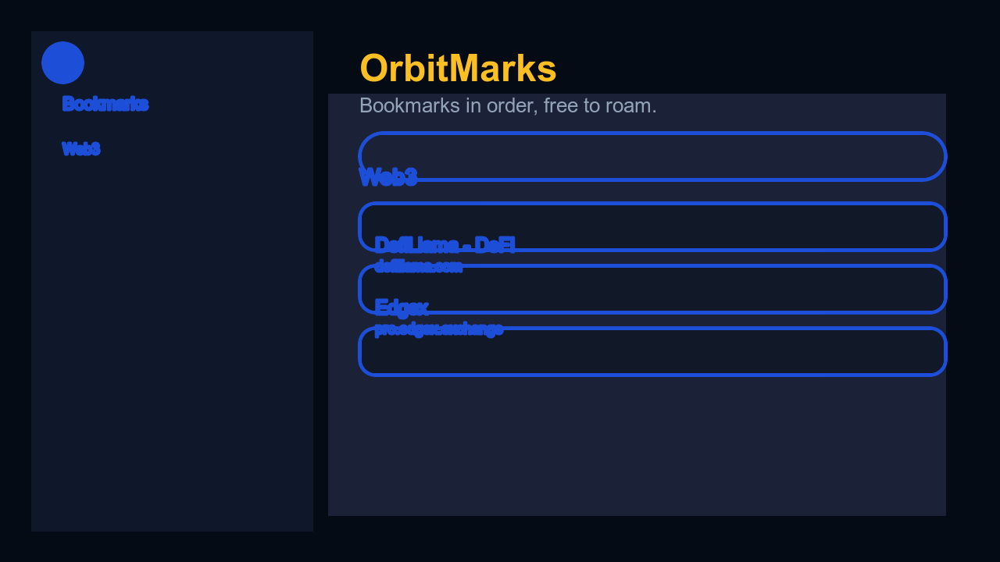
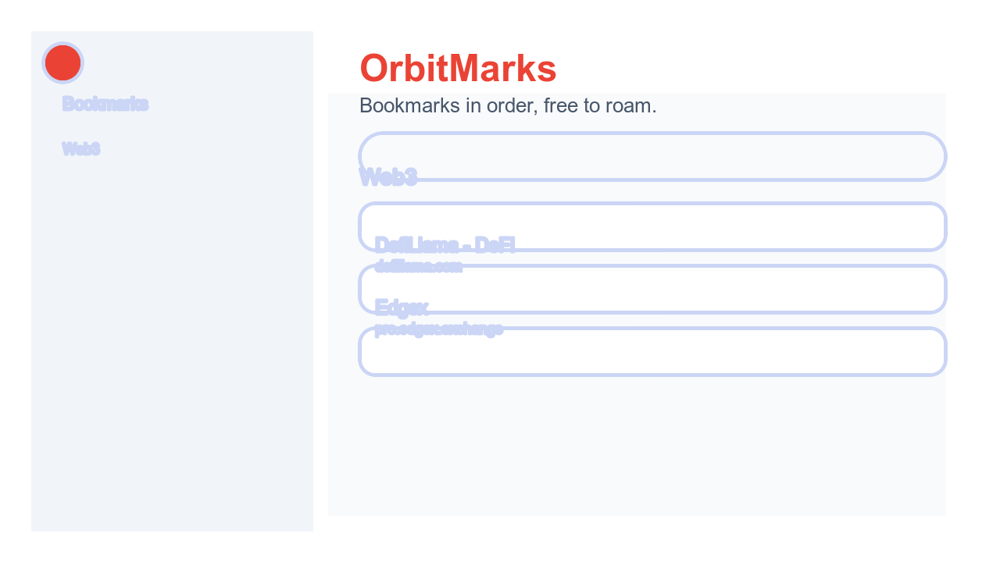

# OrbitMarks

OrbitMarks 是一个 Material / Terminal 混合风格的 Chrome 书签插件，让「散落在各地的书签」重新回到同一个轨道。它支持亮暗主题、实时搜索、树状侧边栏导航，以及快捷的反馈/国际化体验，让浏览器工具栏变成真正实用的启动面板。

## ✨ 功能亮点

- **多彩主题**：内置暗色与亮色两套视觉体系，字体、图标、动效全部自适应。
- **智能搜索**：即时搜索当前文件夹下的书签，结果实时过滤，无需额外操作。
- **层级导航**：支持递归折叠与展开，记忆上次打开的目录，快速在大型书签库中定位。
- **国际化切换**：提供英语/中文/日语/韩语/西语/法语/德语等 10 种语言，并可跟随系统语言自动切换。
- **轻量反馈**：内置反馈提示，点击即可通过邮件联系作者，简单直接。

## 🚀 安装与使用

1. 在 Chrome 浏览器输入 `chrome://extensions` 并开启右上角的 **开发者模式**。
2. 点击「加载已解压的扩展程序」，选择本项目所在目录（即包含 `manifest.json` 的根目录）。
3. 在工具栏固定 OrbitMarks 图标，即可在任何页面里一键打开侧边书签面板。

> **提示**：如需定制图标或翻译，只要替换 `icons/` 下的 PNG 或 `popup.js` 中的 `TRANSLATIONS` 字段即可。

## 🛠 开发

```bash
pnpm install  # 如果需要额外依赖，可自行添加
pnpm dev      # 或直接在 Chrome 中加载该目录进行调试
```

核心文件：
- `popup.html` / `styles.css` / `popup.js`：弹窗 UI、逻辑与主题控制。
- `manifest.json`：声明扩展信息与权限（仅使用 `bookmarks` 权限）。
- `icons/`：多尺寸透明背景的 OrbitMarks 标志。
- `docs/screenshots/`：README 使用的示意图。

## 📸 界面预览

<table>
  <tr>
    <td align="center">
      <strong>Dark Mode</strong><br>
      
    </td>
    <td align="center">
      <strong>Light Mode</strong><br>
      
    </td>
  </tr>
</table>

## 💬 反馈

如有问题或建议，欢迎发送邮件至 [support@btman.net](mailto:support@btman.net)。

---
Made with ❤️ for an organized browsing orbit.
